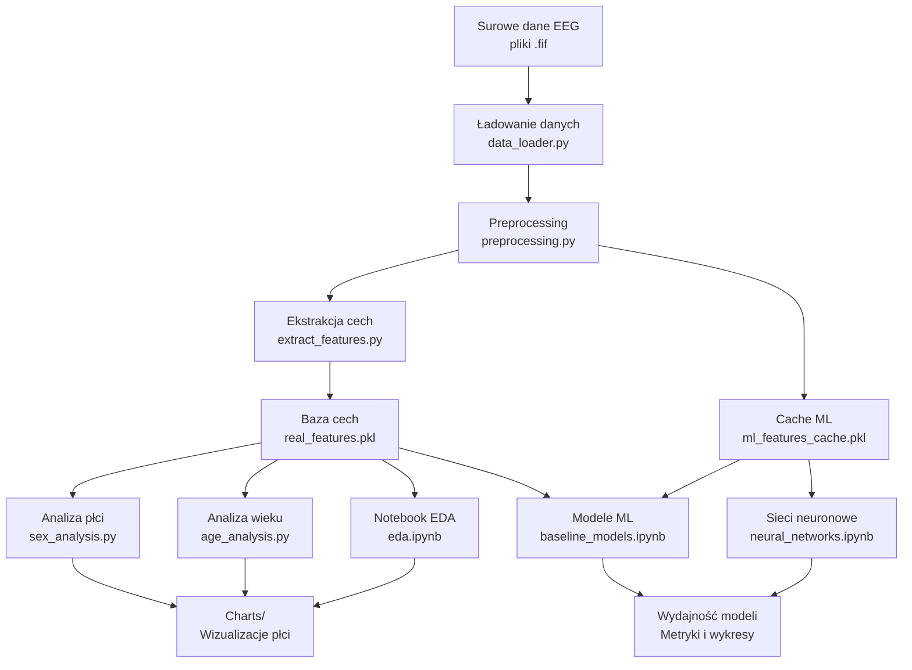
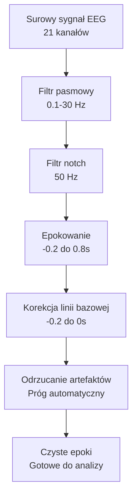
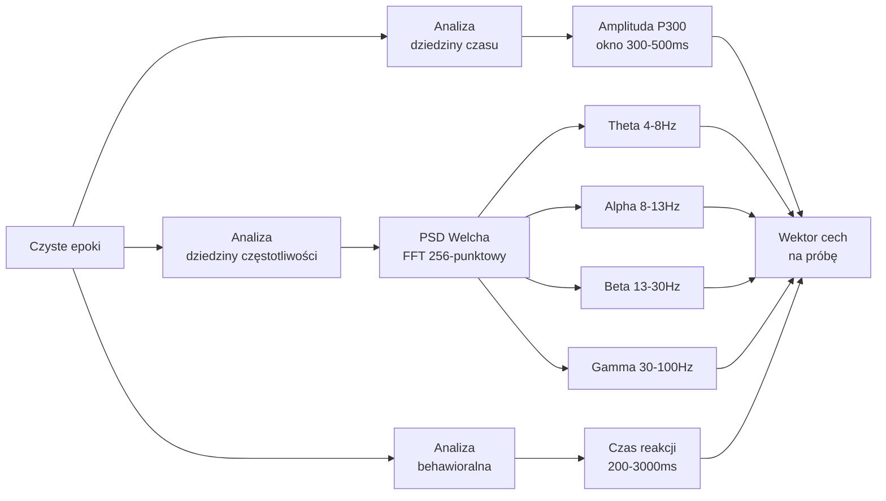
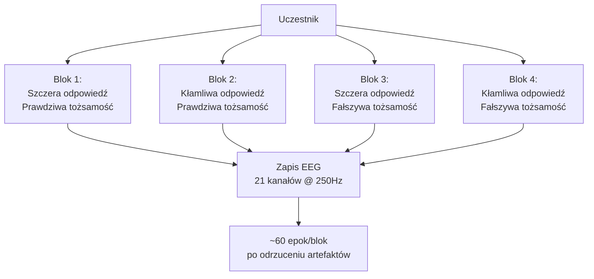

<p align="center">
  <h1 align="center">Detekcja Prawdy i Kłamstwa z EEG</h1>
</p>

## Tech Stack

<div align="center">

[](https://www.python.org/) [](https://mne.tools/) [](https://numpy.org/) [](https://pandas.pydata.org/)

[](https://scipy.org/) [](https://scikit-learn.org/) [](https://matplotlib.org/) [](https://seaborn.pydata.org/)

[](https://pytorch.org/) [](https://jupyter.org/)

[]() [](LICENSE)

</div>

## Start

Automatyczne uruchomienie potoku:

```bash
python run.py
```

Polecenie wykonuje wszystkie skrypty i notebooki:

1. Ekstrakcja cech (`extract_features.py`)
2. Analiza według płci (`sex_analysis.py`)
3. Analiza według wieku (`age_analysis.py`)
4. Notebook EDA (`eda.ipynb`)
5. Notebook modeli ML (`baseline_models.ipynb`)
6. Notebook sieci neuronowych (`neural_networks.ipynb`)

## Notebooki

### Eksploracyjna Analiza Danych (eda.ipynb)

Analiza eksploracyjna obejmująca ocenę jakości sygnału, wizualizację składowej P300, analizę oscylacji neuronalnych, porównania według płci przez 4 zintegrowane wykresy, analizę korelacji z wiekiem przez 1 zintegrowany wykres oraz mapy topograficzne wzorców aktywności mózgu.

### Bazowe Modele Uczenia Maszynowego (baseline_models.ipynb)

Walidacja krzyżowa niezależna od uczestnika przy użyciu strategii GroupKFold z progiem wariancji i selekcją cech opartą na F-score, w tym macierze pomyłek i wykresy porównania wydajności dla wszystkich klasyfikatorów.

**Trening i ewaluacja:**

- Random Forest (RF)
- Support Vector Machine (SVM)
- K-Nearest Neighbors (KNN)

### Eksperymenty z Sieciami Neuronowymi (neural_networks.ipynb)

Podejścia głębokiego uczenia do detekcji kłamstwa przy użyciu wielowarstwowych perceptronów (MLP) z walidacją niezależną od uczestnika.

**Eksperymenty obejmują:**

- porównanie architektur (1–3 warstwy ukryte)
- testowanie funkcji aktywacji (ReLU, Tanh, Sigmoid)
- analiza regularyzacji (kara L2)
- wizualizacja wydajności i metryki

## Potok analityczny



## Szczegóły techniczne

### Architektura analizy

- **15 uczestników** z kompletnymi danymi (wszystkie 4 bloki)
- **4 bloki eksperymentalne** na uczestnika:
  - szczera odpowiedź na prawdziwą tożsamość
  - kłamliwa odpowiedź na prawdziwą tożsamość
  - szczera odpowiedź na fałszywą tożsamość
  - kłamliwa odpowiedź na fałszywą tożsamość
- **21 kanałów EEG** @ 250 Hz częstotliwość próbkowania
- **~60 epok** na uczestnika (po odrzuceniu artefaktów)

### Przetwarzanie sygnałów

1. **Filtracja**: pasmowo-przepustowy 0,1–30 Hz, notch 50 Hz
2. **Epokowanie**: −0,2 do 0,8 s względem bodźca
3. **Korekcja linii bazowej**: −0,2 do 0 s przed bodźcem
4. **Odrzucanie artefaktów**: automatyczne, progowe



## Wyekstrahowane cechy

### 1. Składowa P300 (300–500 ms po bodźcu)

Składowa P300 służy jako marker przetwarzania autoreferencyjnego i wykazuje wyższe amplitudy przy szczerych odpowiedziach na prawdziwą tożsamość i zredukowane amplitudy podczas kłamstwa.

### 2. Oscylacje neuronalne (PSD Welcha)

- **Theta (4–8 Hz)**: pamięć robocza i kontrola poznawcza
- **Alpha (8–13 Hz)**: uwaga i hamowanie
- **Beta (13–30 Hz)**: przygotowanie ruchowe i przetwarzanie poznawcze
- **Gamma (30–100 Hz)**: poznanie wysokiego poziomu (filtr notch 50/100 Hz)

### Ekstrakcja cech

- **dziedzina czasu**: amplituda P300 (średnia 300–500 ms)
- **dziedzina częstotliwości**: PSD Welcha (okno 256-punktowe)
- **behawioralne**: czas reakcji na podstawie adnotacji (zakres 200–3000 ms)



## Projekt eksperymentu



## Struktura projektu

```
IMPLEMENTATION/
├── run.py                       # automatyczny runner potoku
├── extract_features.py          # ekstrakcja cech (P300, Theta, Alpha, Beta, Gamma, RT)
├── sex_analysis.py              # analiza neuronalna według płci
├── age_analysis.py              # analiza korelacji z wiekiem
├── data_loader.py               # narzędzia do wczytywania danych EEG
├── preprocessing.py             # przetwarzanie sygnałów i ekstrakcja cech
├── analysis_utils.py            # funkcje pomocnicze do analizy danych
├── visualization_config.py      # ujednolicona konfiguracja stylów wykresów
├── eda.ipynb                    # notebook eksploracyjnej analizy danych
├── baseline_models.ipynb        # notebook modeli uczenia maszynowego
├── neural_networks.ipynb        # notebook eksperymentów głębokiego uczenia
├── results/
│   ├── real_features.pkl        # wyekstrahowane cechy
│   └── ml_features_cache.pkl    # buforowane cechy ML
└── charts/                      # wygenerowane wizualizacje
```

## Wnioski

### Demografia

- **Płeć**: Mężczyźni wolniejsi o 70 ms od kobiet (712 ms vs 643 ms)
- **Wiek**: Słaba korelacja dodatnia (r=0,127, p=0,368, nieistotna)

### Amplituda P300

| Warunek             | Szczery | Kłamliwy | Różnica |
| ------------------- | ------- | -------- | ------- |
| Prawdziwa tożsamość | 4,73 µV | 3,98 µV  | −16,0%  |
| Fałszywa tożsamość  | 3,64 µV | 3,18 µV  | −12,8%  |

### Czas reakcji

| Warunek             | Szczery | Kłamliwy | Koszt RT |
| ------------------- | ------- | -------- | -------- |
| Prawdziwa tożsamość | 658 ms  | 663 ms   | 5 ms     |
| Fałszywa tożsamość  | 643 ms  | 746 ms   | 103 ms   |

### Wyniki modeli

#### Sieć neuronowa MLP

| Metryka  | CV GroupKFold | Zbiór treningowy |
| -------- | ------------- | ---------------- |
| Accuracy | 46,0%         | 78,2%            |
| F1-Score | 46,9%         | 77,8%            |

**Konfiguracja:** architektura (250→100→50→25→1), aktywacja `tanh`, regularyzacja L2 = 0,0001, 6 463 próbek, 15 uczestników.

Duża różnica między wynikami CV a treningowymi wskazuje na przeuczenie przy tak małej kohortie. Wyniki CV (~47% F1) są poniżej progu 60%, co jest typowe dla zadań detekcji kłamstwa z EEG przy walidacji niezależnej od uczestnika (GroupKFold).
