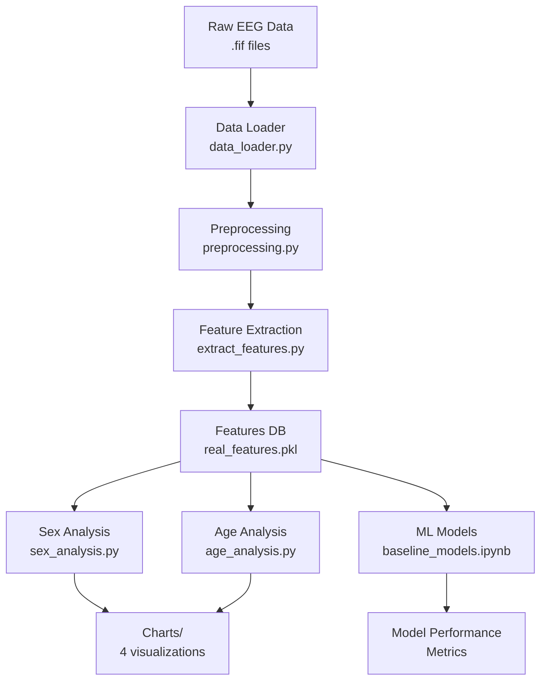
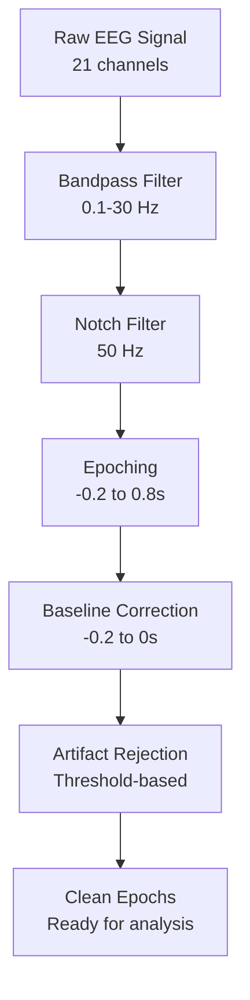
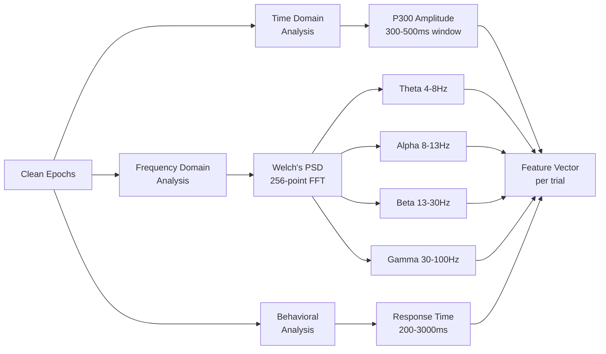
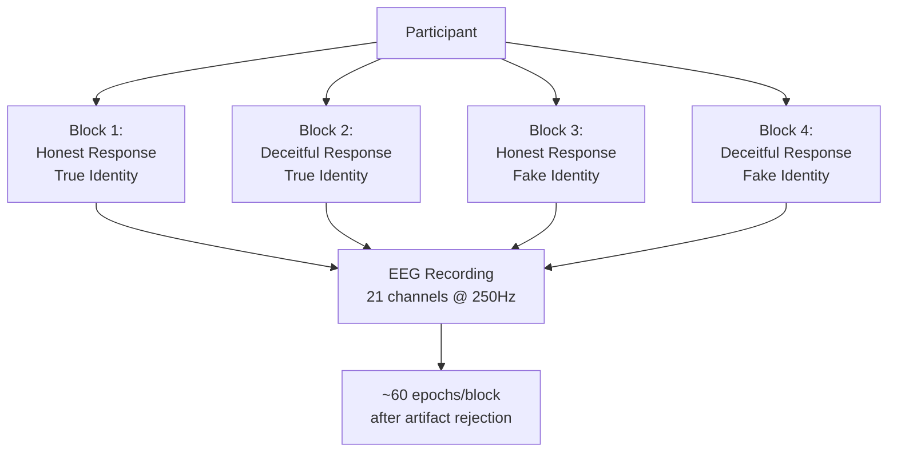

<p align="center">
  <h1 align="center">EEG Truth and Deception Detection</h1>
</p>

<p align="center">
    <strong>Neural patterns of deception through P300, oscillations and behavioral responses</strong>
</p>

## Tech Stack

<div align="center">

[](https://www.python.org/) [](https://mne.tools/) [](https://numpy.org/) [](https://pandas.pydata.org/)

[](https://scipy.org/) [](https://scikit-learn.org/) [](https://matplotlib.org/) [](https://seaborn.pydata.org/)

[](https://pytorch.org/) [](https://jupyter.org/)

[]() [](LICENSE)

</div>

## Notebooks

### Exploratory Data Analysis (eda.ipynb)

Exploratory analysis covering signal quality assessment, P300 component visualization, neural oscillations analysis, sex-based comparisons through 4 integrated charts, age correlation analysis via 1 integrated chart, and topographic maps of brain activity patterns.

### Machine Learning Models (baseline_models.ipynb)

Person-independent cross-validation using GroupKFold strategy with variance threshold and F-score based feature selection, including confusion matrices and performance comparison charts across all classifiers.

##### Training and evaluation of:

- Random Forest Classifier
- Support Vector Machine (SVM)
- K-Nearest Neighbors (KNN)

## Analysis Pipeline



## Technical Details

### Analysis architecture

- **15 participants** with complete data (all 4 blocks)
- **4 experimental blocks** per participant:
  - Honest Response to True Identity
  - Deceitful Response to True Identity
  - Honest Response to Fake Identity
  - Deceitful Response to Fake Identity
- **21 EEG channels** @ 250 Hz sampling rate
- **~60 epochs** per participant (after rejection)

### Signals Processing

1. **Filtering**: 0.1-30 Hz bandpass, 50Hz notch
2. **Epoching**: -0.2 to 0.8s around stimulus
3. **Baseline Correction**: -0.2 to 0s pre-stimulus
4. **Artifact Rejection**: Automatic threshold-based



## Features Extracted

### 1. P300 Component (300-500ms post-stimulus)

P300 component serves as a self-referential processing marker, showing higher amplitudes for honest responses to true identity and reduced amplitudes during deception.

### 2. Neural Oscillations (Welch's PSD)

- **Theta (4-8 Hz)**: Working memory and cognitive control
- **Alpha (8-13 Hz)**: Attention and inhibition
- **Beta (13-30 Hz)**: Motor preparation and cognitive processing
- **Gamma (30-100 Hz)**: High-level cognition (50Hz/100Hz notch filtered)

### Features Extraction

- **Time Domain**: P300 amplitude (300-500ms mean)
- **Frequency Domain**: Welch's PSD (256-point window)
- **Behavioral**: Real annotation-based RT (200-3000ms valid range)



## Project Structure

```
IMPLEMENTATION/
├── extract_features.py          # Feature extraction (P300, Theta, Alpha, Beta, Gamma, RT)
├── sex_analysis.py              # Sex-based neural analysis (4 charts)
├── age_analysis.py              # Age correlation analysis (1 chart)
├── data_loader.py               # EEG data loading utilities
├── preprocessing.py             # Signal processing and feature extraction
├── eda.ipynb                    # Exploratory data analysis notebook
├── baseline_models.ipynb        # Machine learning models notebook
├── results/
│   └── real_features.pkl        # Extracted features (generated)
└── charts/
    ├── sex_erp_waveforms.png
    ├── sex_rt_distribution.png
    ├── sex_rt_comparison.png
    ├── sex_correlation_heatmap.png
    └── age_rt_correlation.png
```

**Dependencies:**

- `mne` - EEG signal processing
- `numpy` - Numerical operations
- `pandas` - Data manipulation
- `matplotlib` - Visualization
- `seaborn` - Statistical plots
- `scipy` - Signal processing and statistics
- `scikit-learn` - Machine learning models

## Experiment Design



## Key Findings

### Demographics

- **Sex**: Males 70ms slower than females (712ms vs 643ms)
- **Age**: Weak positive correlation (r=0.127, p=0.368, not significant)

### P300 Amplitude

| Condition      | Honest  | Deceitful | Difference |
| -------------- | ------- | --------- | ---------- |
| True Identity  | 4.73 µV | 3.98 µV   | -16.0%     |
| False Identity | 3.64 µV | 3.18 µV   | -12.8%     |

### Response Time

| Condition      | Honest | Deceitful | RT Cost |
| -------------- | ------ | --------- | ------- |
| True Identity  | 658 ms | 663 ms    | 5 ms    |
| False Identity | 643 ms | 746 ms    | 103 ms  |
